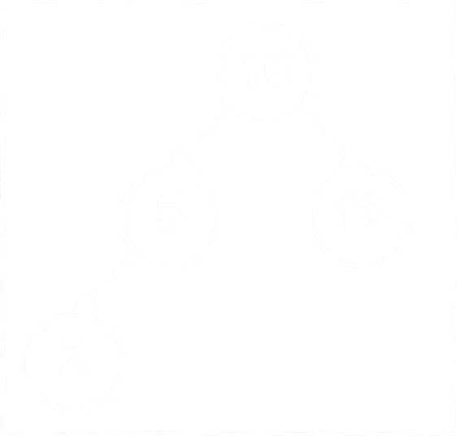

# Задача AVLprefix: АВЛ префикс (60 баллов)

## Условие задачи

Выпишите, какие из заданного списка ключей и в каком порядке нужно добавить в АВЛ-дерево на рисунке, чтобы корректная чёрно-красной раскраске полученного АВЛ-дерева соответствовала указанная префикс-функция.

Ответ состоит из трёх строк:

1) Описание расшифрованной раскраски полученного в результате АВЛ-дерева (большими буквами, через пробел).
2) Ключи, которые нужно было вставить в дерево (в нужном порядке, через пробел). Можно использовать только часть ключей из списка.
3) Ключи полученного дерева в порядке прямого обхода (корень — левое поддерево — правое поддерево).

**Возможные ключи**:  
`1, 6, 7, 11`.

**Префикс-функция**:  
`0 1 2 0 0 1 0 1 2 3 3 3 3`.

*Примечание 1.* Раскраска дерева описывается обходом по уровням в ширину с учётом фиктивных листьев (не содержащих данных). Один из вариантов корректной раскраски для приведённого на рисунке дерева:  
`B B B R B B B B`



## Пример

### Результат работы

```
B R B B B
200 100
200 100
```
