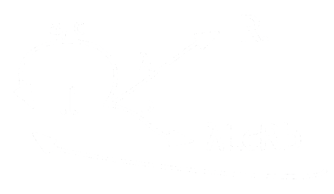

# Задача TD: Диаграмма Тьюринга (45 баллов)

Напишите алгоритм Маркова, состоящий из не более 15 подстановок, эквивалентный в алфавите `A = {a, b, c}` данной диаграмме Тьюринга.

В начале работы МТ управляющая головка находится сразу после входного слова.  

В ответе необходимо выписать по порядку подстановки получившегося НАМ по одной на строке.  

Обычные подстановки выглядят так:  
`<left> -> <right>`

Завершающие подстановки выглядят так:  
`<left> |-> <right>`

Пробелы в начале и в конце частей подстановок `<left>` и `<right>` игнорируются. В `<left` и `<right>` разрешается использовать только `символы латинского алфавита`, а также `*` и `#`.

### Пример правильно форматированного НАМ:

a -> b  
b |-> c